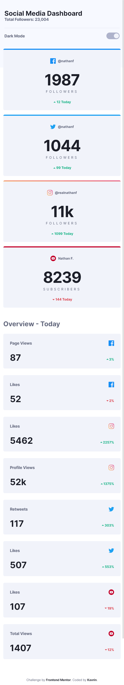
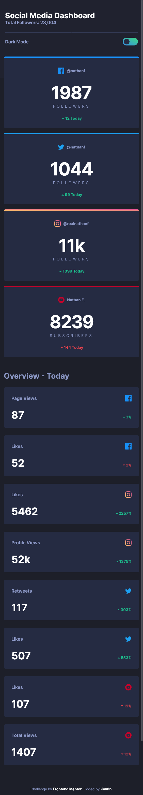
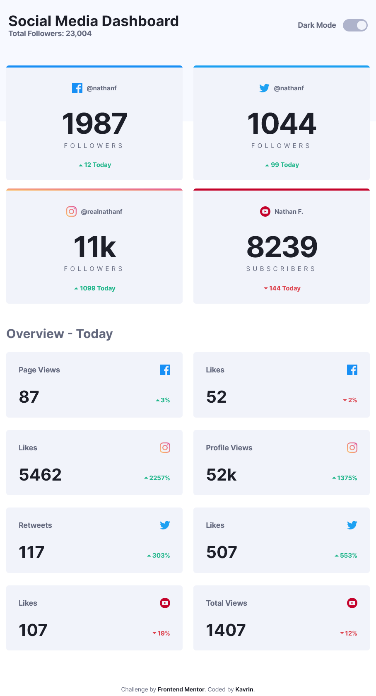
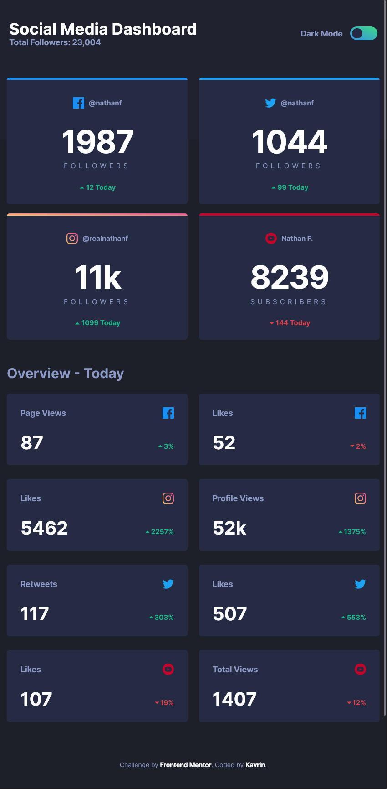
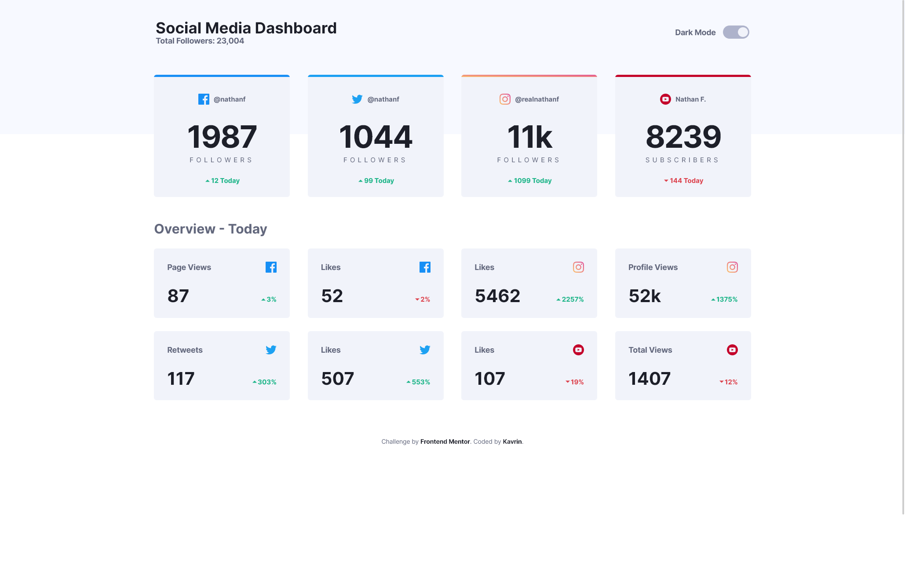
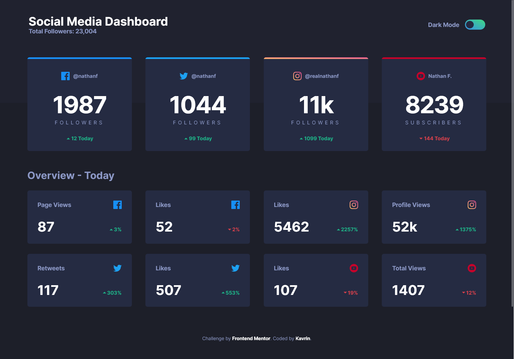

# Frontend Mentor - Social media dashboard with theme switcher solution

This is a solution to the [Social media dashboard with theme switcher challenge on Frontend Mentor](https://www.frontendmentor.io/challenges/social-media-dashboard-with-theme-switcher-6oY8ozp_H). Frontend Mentor challenges help you improve your coding skills by building realistic projects.

## Table of contents

-   [Overview](#overview)
    -   [The challenge](#the-challenge)
    -   [Screenshot](#screenshot)
    -   [Links](#links)
-   [My process](#my-process)
    -   [Built with](#built-with)
    -   [Useful resources](#useful-resources)

## Overview

### The challenge

Users should be able to:

-   View the optimal layout for the site depending on their device's screen size
-   See hover states for all interactive elements on the page
-   Toggle color theme to their preference

### Screenshot

|  |  |

|  |  |

|  |  |

### Links

-   [Solution](https://github.com/kavrindev/frontendmentor/tree/main/socialMediaDashboard)
-   [Live Site](https://kavrindev.github.io/frontendmentor/socialMediaDashboard/)

## My process

### Built with

-   Semantic HTML5 markup
-   CSS custom properties
-   Flexbox
-   CSS Grid

### Useful resources

-   [Dark theme in a day](https://mwichary.medium.com/dark-theme-in-a-day-3518dde2955a) - This article helped me for implement dark mode
